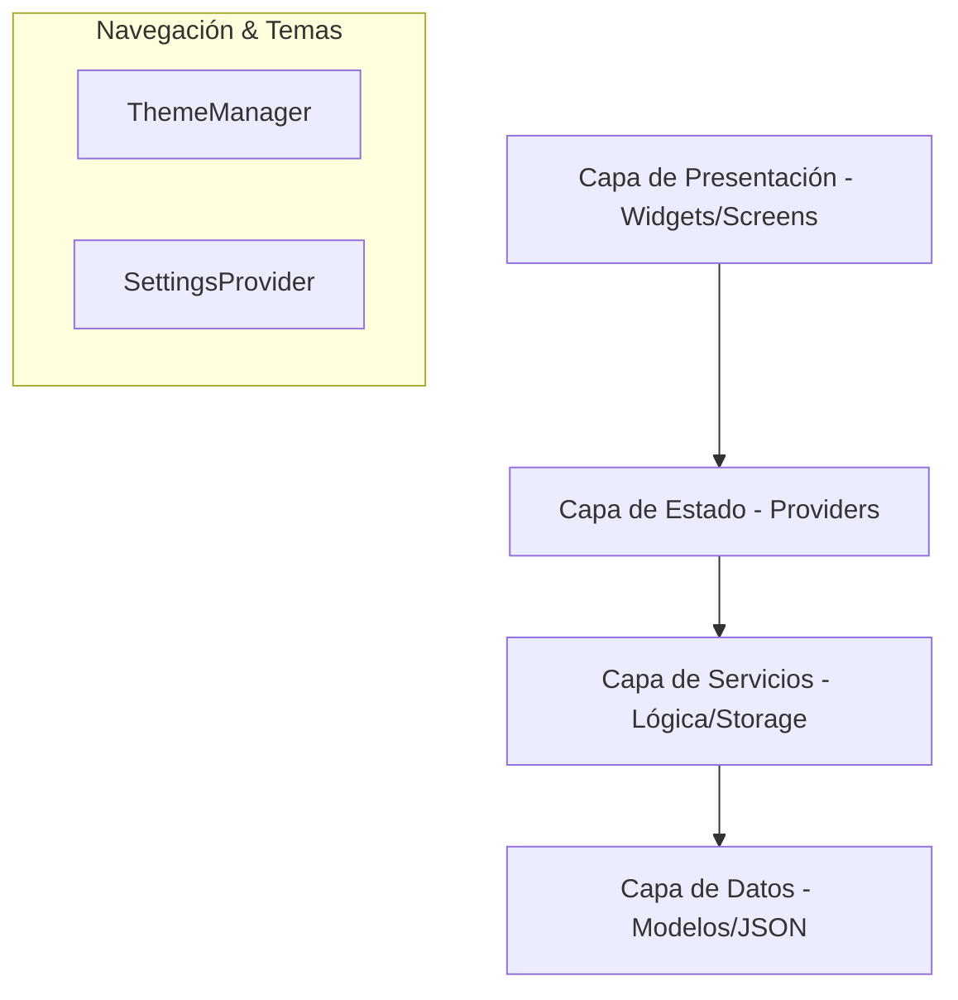
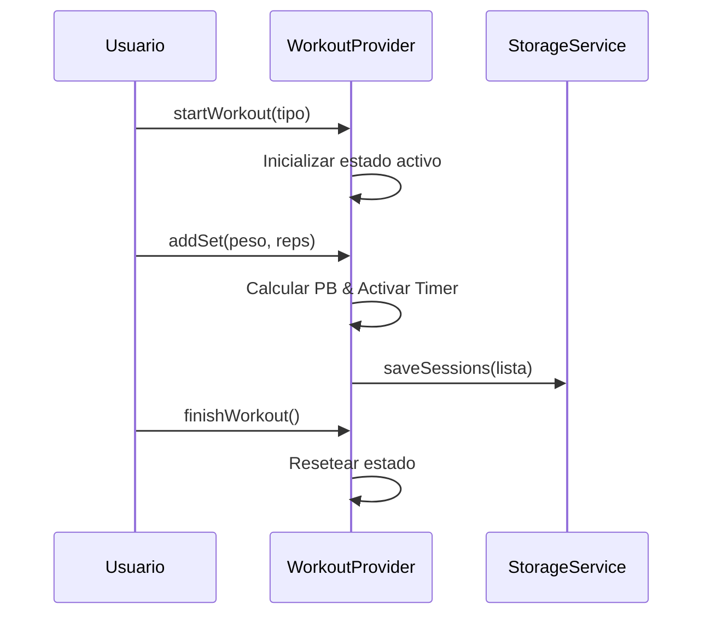

# Arquitectura de TrainerPRO 🏰

TrainerPRO sigue un patrón de diseño **Provider (MVC moderno)** para Flutter, enfocado en el desacoplamiento, la escalabilidad y la eficiencia en dispositivos móviles.

## 🏗️ Estructura de Capas



### 1. Capa de Presentación (`lib/widgets` & `lib/screens`)
- **Screens**: Páginas completas gestionadas por el enrutador inicial en `main.dart`.
- **Widgets**: Componentes seleccionados por su atomicidad y reutilización (ej. `SetCard`, `TimerWidget`).

### 2. Capa de Estado (`lib/providers`)
- **WorkoutProvider**: El cerebro de la app. Gestiona el temporizador, la sesión activa y la persistencia de ejercicios.
- **SettingsProvider**: Gestiona el idioma, el onboarding y las preferencias del usuario.

### 3. Capa de Servicios (`lib/services`)
- **StorageService**: Abstracción de `SharedPreferences`. Maneja la serialización JSON de las sesiones.
- **WorkoutService**: Lógica pura para cálculos de Récords Personales (PB) y sugerencias de entrenamiento.

---

## 📂 Organización de Archivos

```text
lib/
├── core/             # Fundamentos (Constantes, Temas, Utilidades)
├── models/           # Estructuras de datos puras
├── providers/        # Gestión de estado reactivo
├── screens/          # Vistas principales y Onboarding
├── services/         # Lógica de negocio y persistencia
└── widgets/          # Componentes visuales reutilizables
```

## 🔄 Flujo de una Sesión de Entrenamiento


