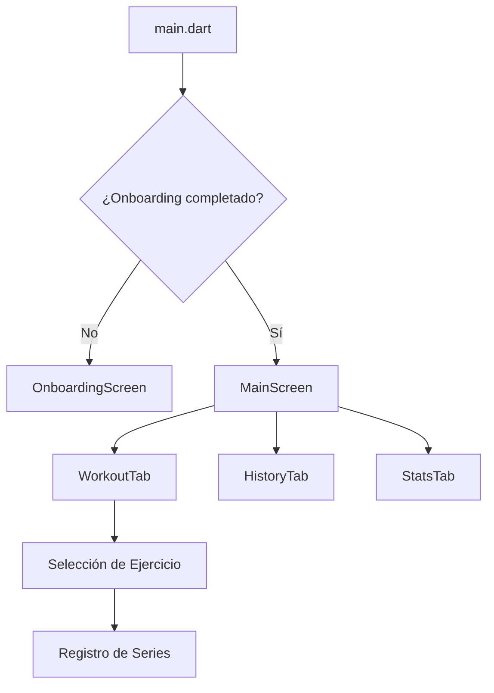

# Guía del Desarrollador: Cómo mejorar TrainerPRO 🛠️

¿Quieres añadir una funcionalidad? Aquí tienes el mapa de ruta para no romper nada.

## 🌟 Añadir una nueva Rutina por Defecto
1. Modifica `lib/core/constants/exercise_database.dart`.
2. Añade la estructura en `routineStructures`.
3. ¡No olvides añadir la traducción de la clave en `translations.dart`!

## 🎨 Cambiar la Estética
El sistema de temas está centralizado en `lib/core/theme/app_theme.dart`.
- Si quieres un nuevo tema, añádelo al `enum AppTheme`.
- Define sus colores en `getTheme`, `getAccentColor` y `getCardColor`.

## 📱 Flujo de Navegación Profesional

## 🛡️ Reglas de Oro
- **Modelos Inmutables**: Usa siempre `.copyWith()` al actualizar estados en los Providers.
- **Haptic Feedback**: Usa `HapticUtils` para cualquier interacción importante. El usuario "siente" la app.
- **Traducciones**: Nunca escribas texto plano en los widgets. Usa `settings.translate('key')`.

---
*Documentación generada por Antigravity para TrainerPRO v2.1.1*
