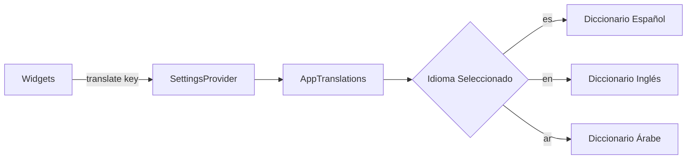

# Internacionalización (i18n) & RTL 🌐

TrainerPRO utiliza un sistema de diccionarios dinámico para soportar múltiples idiomas sin depender de librerías externas pesadas.

## 🗺️ Mapa Mental del Sistema i18n

## 📐 Soporte RTL (Right-to-Left)
Para el soporte del árabe, hemos implementado una lógica especial en `main.dart`:

1.  **Detección de Dirección**: Si el código de idioma es `ar`, establecemos `textDirection: TextDirection.rtl`.
2.  **Adaptación de Layout**: Usamos el widget `Directionality` envolviendo la app para que Flutter invierta automáticamente los márgenes, rellenos y posiciones.
3.  **Temas Adaptativos**: `ThemeManager` recibe actualizaciones sobre el estado RTL para ajustar bordes o animaciones lateralizadas.

## ✍️ Cómo añadir un nuevo idioma
Cualquier desarrollador puede añadir un idioma siguiendo estos pasos:
1.  Ir a `lib/core/utils/translations.dart`.
2.  Añadir un nuevo mapa dentro de `AppTranslations.translations`.
3.  Traducir todas las claves existentes.
4.  Añadir el botón correspondiente en `SettingsScreen`.
