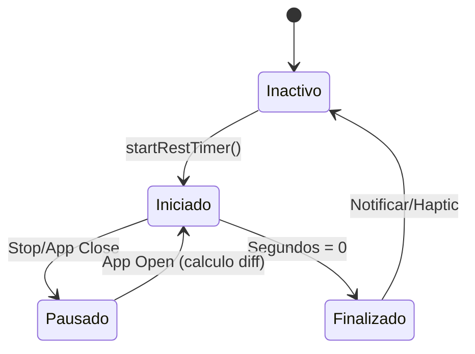

# Gestión de Estado y Datos 💾

Este documento explica cómo fluyen los datos en TrainerPRO y cómo se gestionan los estados complejos.

## 🧠 WorkoutProvider: El Núcleo

Es el proveedor más crítico. Gestiona tres estados concurrentes:

### 1. El Temporizador (Rest Timer)
Utiliza un `Timer.periodic` de Dart.
- **Persistencia**: Para que el tiempo siga corriendo tras cerrar la app, guardamos el `timer_end_time` (DateTime) en SharedPreferences. Al abrir la app, calculamos la diferencia entre `ahora` y `final_time`.

### 2. La Sesión Activa
Controla variables volátiles: `_activeWorkoutType`, `_selectedExercise`, `_currentSessionExercises`.
- Si el usuario sale (`cancelWorkout`), estas variables se limpian sin tocar la persistencia.
- Al finalizar (`finishWorkout`), los datos se empaquetan en un `TrainingSession` y se guardan para siempre.

### 3. Base de Datos de Ejercicios
Gestiona el CRUD de rutinas. La función `updateConfig` es la única que tiene permiso para escribir cambios globales en `WorkoutConfig`.

## 🗄️ Persistencia JSON

Los datos se guardan en dos archivos virtuales gestionados por `StorageService`:

1.  `config`: Contiene la estructura de tus rutinas, ejercicios preferidos y modo de planificación.
2.  `sessions`: Una lista gigante de todas tus sesiones históricas, serializada a formato JSON para ser legible y exportable.

## 🧪 Diagrama de Estado del Timer

